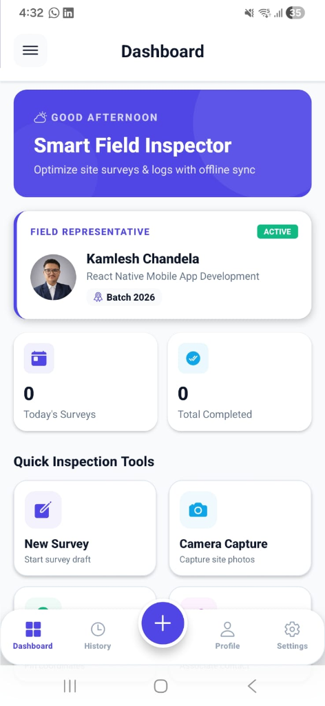
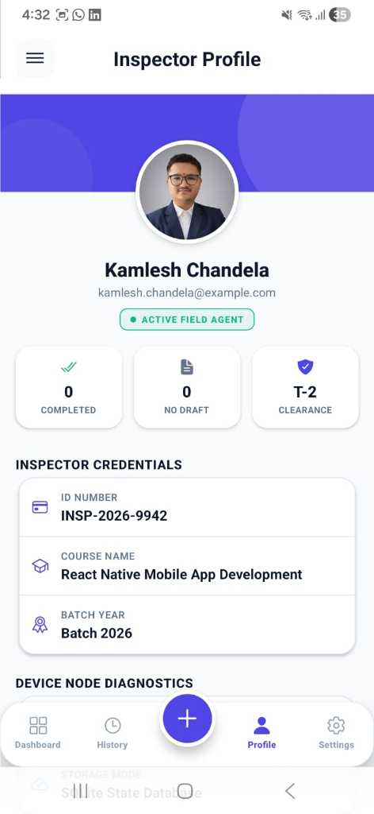
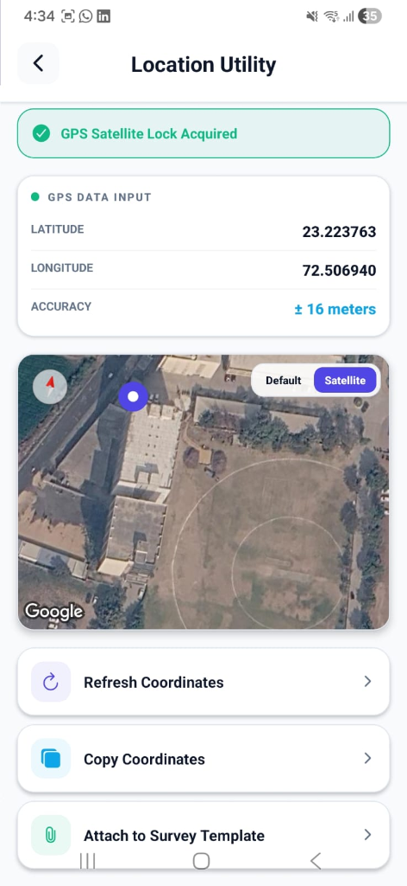

<div align="center">

# 📱 Smart Field Survey & Inspection App
### *Enterprise-Grade Field Operations & Audit Platform*

[](https://expo.dev)
[](https://reactnative.dev)
[](https://www.typescriptlang.org/)
[](https://docs.expo.dev/router/introduction/)
[](https://reactnative.dev)

<p align="center">
  <b>A sleek, modern, and production-ready mobile solution engineered for field site inspections, real-time GPS tracking, camera geotagging, contact linkage, and zero-loss draft survey management.</b>
</p>

</div>

---

## 📸 App Showcase & Interface Highlights

| 📊 Executive Dashboard | 👤 Inspector Profile | 📍 GPS Location Utility |
| :---: | :---: | :---: |
|  |  |  |
| <sub>Time-aware greeting, live metrics & quick tool grid</sub> | <sub>Agent credentials, clearance level & diagnostics</sub> | <sub>Satellite lock, precision GPS & satellite map view</sub> |

---

## 📑 Table of Contents

- [Overview](#-overview)
- [Architecture & Design Philosophy](#-architecture--design-philosophy)
- [Module Highlights & Deep Dive](#-module-highlights--deep-dive)
  - [Module 1: Executive Dashboard](#-module-1--executive-dashboard)
  - [Module 2: Dynamic Survey Form](#-module-2--dynamic-survey-form)
  - [Module 3: Camera Capture & Timestamp Watermark](#-module-3--camera-capture--timestamp-watermark)
  - [Module 4: GPS Geolocation & Satellite Utility](#-module-4--gps-geolocation--satellite-utility)
  - [Module 5: Native Device Contacts Integration](#-module-5--native-device-contacts-integration)
  - [Module 6: Clipboard Data Manager](#-module-6--clipboard-data-manager)
  - [Module 7: Interactive Survey Preview](#-module-7--interactive-survey-preview)
  - [Module 8: Survey History & Filter Matrix](#-module-8--survey-history--filter-matrix)
- [Design System & Theme Tokens](#-design-system--theme-tokens)
- [Folder & File Architecture](#-folder--file-architecture)
- [Tech Stack & Package Matrix](#-tech-stack--package-matrix)
- [Getting Started & Installation](#-getting-started--installation)
  - [Prerequisites](#prerequisites)
  - [Quick Start Guide](#quick-start-guide)
- [Hardware Permissions & Fallback UI](#-hardware-permissions--fallback-ui)
- [Author & Credits](#-author--credits)

---

## 🌟 Overview

The **Smart Field Survey & Inspection App** bridges the gap between field operation audits and enterprise digital reporting. Designed to operate reliably under challenging field conditions, the app provides real-time access to native smartphone hardware—including **high-precision GPS tracking**, **camera watermarking**, **contact syncing**, and **system clipboard integration**.

With a clean, responsive layout built on **React Native** and **Expo SDK 54**, field engineers and site auditors can capture data effortlessly without worrying about lost drafts during screen switching or app navigation.

---

## 🏗 Architecture & Design Philosophy

```text
       ┌─────────────────────────────────────────────────────────┐
       │                Root Drawer Navigator                    │
       │   (Dashboard, Camera, Location, Contacts, Settings)     │
       └──────────────────────────┬──────────────────────────────┘
                                  │
       ┌──────────────────────────▼──────────────────────────────┐
       │               Bottom Tab Navigation                     │
       │   [ Dashboard ]  [ History ]  [ (+) New ]  [ Profile ]  │
       └──────────────────────────┬──────────────────────────────┘
                                  │
       ┌──────────────────────────▼──────────────────────────────┐
       │              Global SurveyContext Store                 │
       │   - Live Survey Draft State (Form, Photo, GPS, Contact) │
       │   - Persistent Submitted Survey Records Array           │
       └─────────────────────────────────────────────────────────┘
```

- **Hybrid Navigation Architecture**: Combines a persistent side **Drawer Navigator** with a bottom **Tab Bar**. The drawer wraps the entire application, giving instant access to utility screens (`Camera`, `Location`, `Contacts`, `Clipboard`, `Settings`) from any context.
- **Zero-Loss Draft Persistence (`SurveyContext`)**: State is synchronized across all screens. Navigating from the *New Survey* form to the *GPS Location* module or *Camera Viewfinder* attaches data seamlessly without discarding form inputs.
- **Type-Safe Domain Modeling**: Engineered with strict TypeScript interfaces (`Survey`, `SurveyDraft`, `SurveyLocation`, `SurveyContact`).
- **Interactive Fallback UI**: Gracefully handles denied permission states for Camera, Location, and Contacts with built-in retry mechanisms and user prompts.

---

## 📱 Module Highlights & Deep Dive

### 📊 Module 1 — Executive Dashboard


- **Smart Greeting**: Displays contextual time-based greetings (*Good Morning / Good Afternoon / Good Evening*).
- **Field Agent Badge**: Shows active agent credentials, batch details, and active status (`ACTIVE`).
- **Real-Time Metrics**: Live counter tracking *Today's Surveys* and *Total Completed Surveys*.
- **Quick Action Grid**: Instant navigation shortcuts to *New Survey*, *Camera Capture*, *Pin Location*, and *Associate Contact*.
- **Recent Activity Feed**: Tap-to-view stream of recently submitted field surveys.

---

### 👤 Inspector Profile & Node Diagnostics


- **Agent Identity Card**: Displays high-resolution inspector avatar, email handle, and active clearance badge (`T-2 CLEARANCE`).
- **Inspection Clearance**: Summary of completed reports, open drafts, and security level.
- **Credentials Matrix**: Formal ID (`INSP-2026-9942`), Course Name, and Batch Year (`Batch 2026`).
- **Device Diagnostics**: Real-time status monitor showing storage mode and database state.

---

### 📍 Module 4 — GPS Geolocation & Satellite Utility


- **Satellite Lock Status**: Displays live GPS lock confirmation badge (`GPS Satellite Lock Acquired`).
- **Coordinate Precision**: Real-time extraction of Latitude, Longitude, and Accuracy margins (`±16 meters`).
- **Interactive Map View**: Embedded satellite map rendering current inspector position with Default / Satellite toggle modes.
- **One-Tap Utility Actions**:
  - 🔄 **Refresh Coordinates**: Re-queries device GPS sensors.
  - 📋 **Copy Coordinates**: Copies formatted coordinates to system clipboard.
  - 📎 **Attach to Survey Template**: Direct deep-link attachment to current survey draft.

---

### 📝 Module 2 — Dynamic Survey Form
- **Structured Inputs**: Site Name, Client Name, and Comprehensive Description with real-time validation.
- **Priority Selector**: Color-coded segmented controls (**Low** 🟢 | **Medium** 🟡 | **High** 🔴).
- **Native Date & Time Picker**: Integrated `@react-native-community/datetimepicker`.
- **Live Attachment Badges**: Dynamic indicators showing attached Photo, GPS Location, and Contact details.

---

### 📷 Module 3 — Camera Capture & Timestamp Watermark
- **Live Viewfinder**: Interactive `CameraView` with front/rear camera toggle.
- **Timestamp Overlay**: Captures exact inspection date and time directly onto photo previews.
- **Interactive Review**: Preview screen allowing inspectors to *Use Photo*, *Retake*, or *Delete*.

---

### 👤 Module 5 — Device Contacts Integration
- **Native Contact Sync**: Queries phone contacts via `expo-contacts` into a high-performance `FlatList`.
- **Live Search Filter**: Instant contact search by name with active results counter.
- **Pull-to-Refresh**: Integrated `RefreshControl` for live address book syncing.
- **Color-Coded Initials**: Auto-generated initial avatars for contacts.

---

### 📋 Module 6 — System Clipboard Manager
- **Buffer View**: Inspect active system clipboard text.
- **Quick Copies**: Copy Survey ID, linked Contact Number, or GPS Coordinates.
- **Auto-Paste into Notes**: Single-tap insertion of clipboard content into survey observation notes.

---

### 👁️ Module 7 — Interactive Survey Preview
- **Full Inspection Summary**: Detailed breakdown of Site Details, Priority, Date, Photo with Timestamp, GPS Coordinates, Contact Person, and Notes.
- **Dual Mode Navigation**:
  - **Draft Mode**: Offers *Edit Survey* (re-fills form) and *Submit Survey* (saves to history).
  - **Read-Only Mode**: Displayed when reviewing submitted records from history.

---

### 🗂️ Module 8 — Survey History & Filter Matrix
- **Virtualized List**: Powered by `FlatList` for smooth scrolling over large datasets.
- **Search & Filter Matrix**: Search by site/client name, filter by priority chips (**All**, **Low**, **Medium**, **High**).
- **Attachment Badges**: Chips indicating attached media (Camera, Location, Contact, Notes).
- **Record Management**: Delete archived records with interactive confirmation prompts.

---

## 🎨 Design System & Theme Tokens

All styling tokens are centralized in [`constants/theme.ts`](./constants/theme.ts) to ensure UI harmony and seamless Dark / Light mode switching:

| Token Category | Swatch / Hex | Design Token Name | Purpose |
| :--- | :---: | :--- | :--- |
| **Primary** | `🟦 #4F46E5` | `Colors.light.primary` | Main Brand Color & Nav Highlights |
| **Secondary** | `🟦 #0EA5E9` | `Colors.light.secondary` | Action Buttons & Active Statuses |
| **Accent** | `🟪 #D946EF` | `Colors.light.accent` | Highlights & Special Chips |
| **Success** | `🟩 #10B981` | `Colors.light.success` | GPS Satellite Lock & Low Priority |
| **Warning** | `🟧 #F59E0B` | `Colors.light.warning` | Medium Priority Flags & Alerts |
| **Error** | `🟥 #EF4444` | `Colors.light.error` | High Priority Flags & Delete Actions |
| **Background (Light)** | `⬜ #F8FAFC` | `Colors.light.background` | Canvas Light Mode Background |
| **Background (Dark)** | `⬛ #0F172A` | `Colors.dark.background` | Canvas Dark Mode Background |

---

## 📁 Folder & File Architecture

```text
my-app/
├── app/                        # Expo Router File-Based Routes
│   ├── (tabs)/                 # Bottom Tab Navigator Screens
│   │   ├── _layout.tsx         # Tab Bar configuration & styles
│   │   ├── index.tsx           # Module 1: Executive Dashboard
│   │   ├── new-survey.tsx      # Module 2: Create / Edit Survey Form
│   │   ├── history.tsx         # Module 8: Survey History & Filter Matrix
│   │   └── profile.tsx         # Inspector Profile Screen
│   ├── _layout.tsx             # Root Layout & Drawer Navigation Wrapper
│   ├── camera.tsx              # Module 3: Camera Capture & Viewfinder
│   ├── location.tsx            # Module 4: GPS Satellite Geolocation
│   ├── contacts.tsx            # Module 5: Device Contacts Manager
│   ├── clipboard.tsx           # Module 6: System Clipboard Sync
│   ├── preview.tsx             # Module 7: Survey Summary & Submission
│   ├── settings.tsx            # Application Settings
│   └── modal.tsx               # Utility Modal Dialogs
├── assets/                     # Application Media & Icons
│   ├── images/                 # App logos, favicon, splash screen
│   └── screenshots/            # UI Showcase Screenshots
│       ├── dashboard.png       # Executive Dashboard Screenshot
│       ├── profile.png         # Inspector Profile Screenshot
│       └── location.png        # GPS Location Utility Screenshot
├── components/                 # Shared UI Components
│   ├── CustomHeader.tsx        # Screen Header with Drawer Trigger
│   ├── CustomDrawerContent.tsx # Custom Drawer Side Menu
│   └── ThemedText.tsx          # Theme-aware text wrapper
├── constants/                  # Configuration & Global Tokens
│   ├── config.ts               # Student & Inspector profile configuration
│   └── theme.ts                # Design tokens (Colors, Spacing, Radii, Shadows)
├── context/                    # State Management
│   └── SurveyContext.tsx       # Global Survey State & Draft Store
└── hooks/                      # Custom React Hooks
```

---

## 🛠 Tech Stack & Package Matrix

| Core Technology / Package | Package Version | Feature Responsibility |
| :--- | :--- | :--- |
| **React Native** | `0.81.5` | Cross-platform UI core framework |
| **Expo SDK** | `~54.0.35` | Native mobile application suite |
| **Expo Router** | `~6.0.24` | File-based dynamic routing |
| **TypeScript** | `~5.9.2` | Static type safety & domain modeling |
| **expo-camera** | `~17.0.10` | Custom live camera viewfinder & capture |
| **expo-location** | `~19.0.8` | GPS satellite location query engine |
| **react-native-maps** | `1.20.1` | Native Google / Apple maps rendering |
| **expo-contacts** | `~15.0.11` | Address book integration |
| **expo-clipboard** | `~8.0.8` | System clipboard buffer access |
| **@react-navigation/drawer** | `^7.13.2` | Slide-out Drawer Navigation |
| **@react-navigation/bottom-tabs** | `^7.4.0` | Modern Bottom Navigation Tab Bar |
| **@react-native-community/datetimepicker** | `8.4.4` | Native Date & Time selector |

---

## 🚀 Getting Started & Installation

### Prerequisites

Before running the application, make sure your environment includes:
- **Node.js**: Version `18.0.0` or higher
- **npm** (v9+) / **yarn** / **pnpm**
- **Expo Go** app installed on your physical iOS or Android device, OR a configured **Android Studio Emulator** / **Xcode iOS Simulator**.

### Quick Start Guide

1. **Clone the Repository**:
   ```bash
   git clone https://github.com/kamleshchandela/reactive-native-1.git
   cd reactive-native-1/my-app
   ```

2. **Install Dependencies**:
   ```bash
   npm install
   ```

3. **Start the Expo Development Server**:
   ```bash
   npm run start
   ```

4. **Launch on Target Platform**:
   - 📱 **Physical Phone**: Scan the terminal QR code using **Expo Go**.
   - 🤖 **Android Emulator**: Press `a` in the terminal.
   - 🍎 **iOS Simulator**: Press `i` in the terminal.
   - 🌐 **Web Browser**: Press `w` in the terminal.

---

## 🔒 Hardware Permissions & Fallback UI

The app handles device hardware security with user permission prompts:

- 📷 **Camera (`CAMERA`)**: Used solely for site photo documentation and timestamp overlays.
- 📍 **Location (`ACCESS_FINE_LOCATION`)**: Used for fetching exact site GPS coordinates.
- 👤 **Contacts (`READ_CONTACTS`)**: Used to associate client phone numbers with survey logs.

*If any permission is denied by the user, the app displays a fallback screen with clear explanation and an interactive **Grant Permission** retry button.*

---

## 👤 Author & Credits

<div align="center">

### **Kamlesh Chandela**
*Lead Mobile Developer & Student*

[](https://github.com/kamleshchandela)
[](https://github.com/kamleshchandela)
[](https://github.com/kamleshchandela)

</div>

---

<div align="center">
  <sub>Built with ❤️ using React Native, Expo SDK 54 & TypeScript.</sub>
</div>
